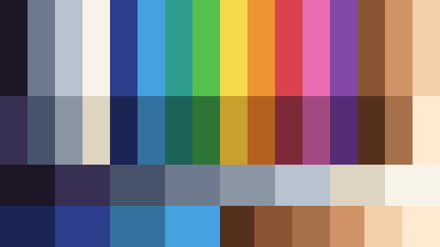

# Quarp

> Имя выбрано 2026-08-17 (quark + warp: «маленький» + «перемотка времени»); финализируется
> после юридического чек-листа — см. [ADR-008](docs/DECISIONS.md). Прежнее кодовое имя —
> Sharp-PICO (отклонено: «Sharp» и «PICO» — чужие торговые марки).

**Фэнтези-консоль, на которой игры пишут на настоящем C#. Две модели: QUARP-8 и QUARP-16.**

Как PICO-8 или TIC-80: маленький выдуманный ретро-компьютер с жёсткими ограничениями
(разрешение, палитра, размер картриджа), встроенной философией «маленьких законченных игр»
и картриджем — одним файлом, которым можно поделиться. Но вместо Lua — полноценный C#:
типы, IDE, автодополнение, рефакторинг, Roslyn.

## Чем отличается от всех остальных

| Фича | Что это даёт |
|---|---|
| **Настоящий C#** | Пишешь в VS Code / Rider со всеми удобствами. Не диалект, не транспиляция — Roslyn компилирует твой код. |
| **Горячая замена кода** | Сохранил файл — игра перезапустилась мгновенно. В связке с детерминизмом: игра *продолжает идти с того же места* с новым кодом (через ресимуляцию — комфортно на коротких сессиях, честные цифры в архитектуре). |
| **Детерминированная симуляция** | Фиксированные тики, одинаковый результат на любом железе. Из коробки: реплеи, перемотка вперёд/назад, ускорение/замедление. |
| **Широкий экран 16:9** | Не квадрат из эпохи ЭЛТ. На uConsole, мониторах и телевизорах — пиксель-в-пиксель, целочисленный масштаб. |
| **Два профиля железа** | Профиль **8** (крошечный, база 8×8) и профиль **16** (уровень SNES, база 16×16). Один редактор, одна экосистема, строгое соотношение ×2. |

## Профили виртуального железа

| | QUARP-8 (профиль 8) | QUARP-16 (профиль 16) |
|---|---|---|
| Экран | 160×90 (16:9) | 320×180 (16:9) |
| Сетка тайлов | 20 × 11.25 по 8×8 | 20 × 11.25 по 16×16 |
| Цвета | 16 | 32 |
| Звук | 4 канала | 8 каналов |
| Картридж | ≤ 128 КБ | ≤ 512 КБ |

Полные спецификации: [docs/SPEC-8.md](docs/SPEC-8.md), [docs/SPEC-16.md](docs/SPEC-16.md).
Лимиты профиля фиксируются при создании картриджа и не переключаются «на лету» — ограничения и есть продукт.

Разрешение 160×90 — вердикт владельца по итогам шести прототипов «худших жанров»
(ADR-021, замещает временный выбор 128×72 из ADR-005); 320×180 у профиля 16 —
композиция строгого правила ×2 (ADR-005) с этим вердиктом, черновик до ратификации
в M6 (SPEC-16.md).

## Статус

**Пре-альфа, вехи M0–M3 сданы** (2026-08-18). Консоль играет, звучит и умеет
перематывать время; 623 теста зелёные; CI доказывает совпадение кадров **и звука**
между windows-x64 и linux-arm64.

```bash
quarp                     # без аргументов — заставка и главное меню: библиотека игр,
                          #   загрузка картриджа (диалог или бросок файла в окно), новая игра;
                          #   в скриптах и CI используйте sim/replay/build — только они
                          #   headless, голый quarp открывает окно
quarp run carts/snake     # играть; правка кода на лету продолжает игру с того же места
quarp new mygame          # заготовка картриджа + dev-проект для подсказок IDE
                          #   и .vscode: F5 запускает игру под отладчиком с точками останова
quarp audio build mygame  # собрать sfx.txt/music.txt в банки
quarp sim <cart> --ticks N --every K   # headless-прогон, хэши кадра и звука
quarp replay record|play  # запись и воспроизведение реплеев (.qrpr)
```

Что уже работает: растеризатор с спрайтами и тайловой картой, свой шрифт 4×6,
настоящий C# в картридже (Roslyn + collectible ALC), горячая замена кода в режиме
«продолжение», реплеи, перемотка и скорости от ×1/8 до ×8, четырёхканальный
целочисленный синтезатор, анализатор правил детерминизма (QRP1001–1004).



Порядок работ: профиль 8 доводится до рабочего состояния на Windows → профиль 16 →
публичный релиз сразу с обоими профилями. Подробно: [docs/ROADMAP.md](docs/ROADMAP.md).

## Документация

- [SPEC-8.md](docs/SPEC-8.md) — спецификация профиля 8 (черновик до ратификации)
- [SPEC-16.md](docs/SPEC-16.md) — спецификация профиля 16 (черновик до ратификации)
- [ARCHITECTURE.md](docs/ARCHITECTURE.md) — архитектура: ядро, оболочки, конвейер картриджей, детерминизм
- [ROADMAP.md](docs/ROADMAP.md) — дорожная карта по вехам
- [CODESTYLE.md](docs/CODESTYLE.md) — стиль кода и правила разработки
- [DECISIONS.md](docs/DECISIONS.md) — журнал принятых решений (ADR)
- [PLAYBOOK.md](docs/PLAYBOOK.md) — как ведётся разработка: роли, рабочие приказы, правила проверки, якорные хэши
- [RESEARCH.md](docs/RESEARCH.md) — сводка исследования ниши (август 2026), на которую опираются решения
- [REPLAY-FORMAT.md](docs/REPLAY-FORMAT.md) — формат реплея `.qrpr` и то, что сравнивает CI между архитектурами
- [AUDIO-FORMAT.md](docs/AUDIO-FORMAT.md) — формат банков `sfx.bin`/`music.bin` и авторский текст `sfx.txt`/`music.txt`
- [CLIPBOARD-FORMAT.md](docs/CLIPBOARD-FORMAT.md) — hex-текст буфера обмена: спрайты, карта, SFX, музыка одной строкой
- [DEBUGGING.md](docs/DEBUGGING.md) — отладка картриджа: точки останова прямо в коде игры по F5, остановка на нужном тике и перемотка к багу

## Чем проект НЕ является

- **Не бизнес.** Проверенный факт (исследование августа 2026): в этой нише зарабатывает
  ровно один продукт в мире — PICO-8. Это хобби, портфолио и инструмент для удовольствия.
- **Не движок общего назначения.** Никакого 3D, шейдеров, произвольных разрешений,
  миллионов цветов. Есть Unity и Godot.
- **Не песочница безопасности (v1).** Картридж — это программа. Запуск чужого картриджа =
  запуск чужой программы; исходный код картриджей всегда открыт и виден перед запуском.

## Платформы (план)

Windows → Linux / macOS / Raspberry Pi (uConsole) → веб-плеер → Android. iOS — стретч-цель.
